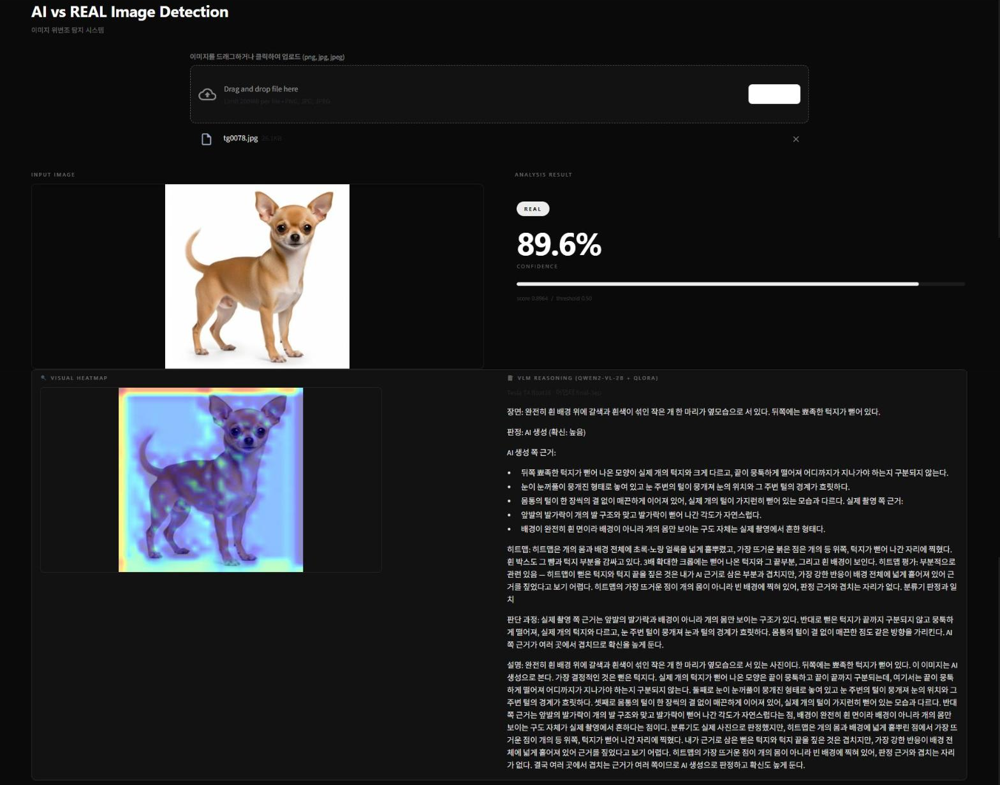
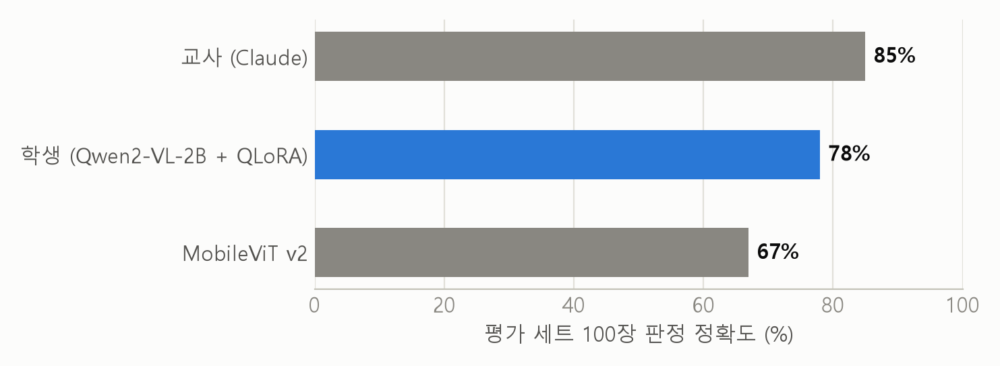
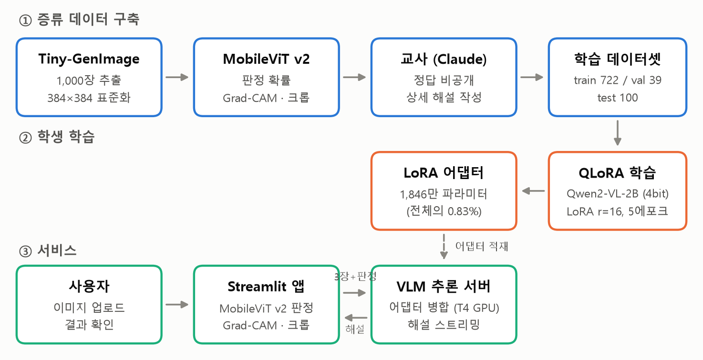
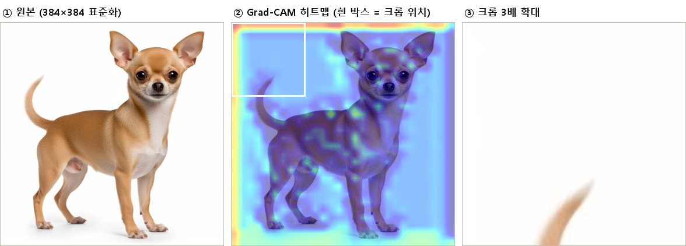

<div align="center">

# AI vs REAL

**AI 생성 이미지를 판별하고, 그 근거를 한국어로 설명하는 웹 서비스**

MobileViT v2가 판정하고, 직접 증류한 Qwen2-VL이 이유를 씁니다.




</div>

---

## 무엇을 하는가

사진 한 장을 올리면 세 가지가 나옵니다.

| | 결과 | 만드는 모델 |
|---|---|---|
| 1 | AI 생성인지 실제 사진인지, 그리고 확신도 | MobileViT v2 |
| 2 | 분류기가 어디를 보고 판정했는지 (Grad-CAM 히트맵) | MobileViT v2 |
| 3 | 장면, 양쪽 근거, 히트맵 평가, 결론으로 이어지는 한국어 해설 | Qwen2-VL-2B + QLoRA |

1학기에는 3번을 상용 Claude API로 만들었습니다. 2학기에는 Claude가 쓴 해설 1,000건을 작은 모델에
옮겨 담아(지식 증류) **외부 API 없이** 해설을 만들도록 바꿨습니다.

## 결과

Tiny-GenImage에서 뽑은 평가 세트 100장(실제 50, 생성 50) 기준입니다.

| 모델 | 역할 | 판정 정확도 |
|---|---|---|
| Claude | 교사 | 85% |
| **Qwen2-VL-2B + QLoRA** | **학생 (이 저장소의 모델)** | **78%** |
| MobileViT v2 | 분류기 | 67% |

학생은 분류기보다 11%p 높습니다. 교사를 그대로 베끼지 않고, 입력으로 함께 받는 분류기 판정을
상황에 따라 따르거나 뒤집습니다. 분류기가 강한 ADM에서는 8장을 모두 맞혔고, 분류기가 50장 중 22장만
맞힌 실제 사진에서는 43장을 맞혔습니다.

<div align="center">

</div>

덧붙여 Grad-CAM을 1,000장에 대해 검증한 결과, 히트맵이 판정 근거를 제대로 짚은 경우는 22.3%뿐이었고
최고점이 이미지 모서리에 찍히는 비율이 우연의 2.6배였습니다. 자세한 수치는
[distill/REPORT.md](distill/REPORT.md)에 있습니다.

## 어떻게 동작하는가

<div align="center">

</div>

**학습 단계.** 이미지 1,000장마다 원본, Grad-CAM 히트맵, 히트맵 최고점을 3배 확대한 크롭을 만듭니다.
Claude가 정답을 모르는 채로 이 3장을 보고 해설을 쓰고, Qwen2-VL-2B가 같은 입력에서 그 해설을
재현하도록 QLoRA로 학습합니다. 전체 22.3억 파라미터 중 0.83%만 학습하므로 VRAM 8GB에서 돌아갑니다.

<div align="center">

<br><sub>학생 모델이 받는 3장. 이 사진은 Midjourney로 만든 것인데 분류기는 실제 사진(0.89)으로 오판했고, 학생은 AI 생성으로 맞혔습니다.</sub>
</div>

**서비스 단계.** TensorFlow와 PyTorch가 요구하는 numpy 버전이 달라 한 환경에 넣을 수 없습니다. 그래서
환경을 둘로 나누고 HTTP로 잇습니다.

```
Streamlit 앱 (TensorFlow)                 추론 서버 (PyTorch)
  이미지 업로드                              Qwen2-VL-2B + LoRA 병합
  MobileViT v2 판정      ── 3장 + 판정 ──▶   해설 생성
  Grad-CAM · 크롭        ◀── 글자 단위 ───   스트리밍
```

## 빠른 시작

Windows, Python 3.11 기준입니다. 모델 파일은 Git LFS로 받습니다.

```bash
git lfs install
git clone https://github.com/Sangmok-Woo/Image-Detection.git
cd Image-Detection
```

**1. 앱 환경 (MobileViT)**

```bash
py -3.11 -m venv venv
venv\Scripts\python -m pip install -r requirements.txt
```

**2. 추론 서버 환경 (Qwen2-VL)**

```bash
py -3.11 -m venv venv-train

:: NVIDIA GPU가 있으면
venv-train\Scripts\python -m pip install torch torchvision --index-url https://download.pytorch.org/whl/cu124
:: 없으면
venv-train\Scripts\python -m pip install torch torchvision --index-url https://download.pytorch.org/whl/cpu

venv-train\Scripts\python -m pip install "transformers>=4.49" peft accelerate bitsandbytes pillow
```

**3. 실행**

```bash
run.cmd
```

추론 서버(8502)와 앱(8501)이 함께 뜹니다. 브라우저에서 http://localhost:8501 을 엽니다.
Qwen2-VL 베이스 모델(4.4GB)은 저장소에 없고, 처음 실행할 때 Hugging Face에서 자동으로 받습니다.

> 2번을 건너뛰어도 앱은 뜹니다. 그 경우 MobileViT 판정과 히트맵만 나옵니다.

## GPU가 없을 때: Colab으로 해설만 분리

해설은 긴 글을 한 글자씩 쓰는 작업이라 CPU로는 느립니다. 같은 사진 한 장으로 잰 값입니다.

| 추론 서버 위치 | 첫 글자 | 해설 완료 |
|---|---|---|
| 노트북 CPU (Ryzen 5 7530U) | 약 2분 | 약 7분 30초 |
| Colab T4, 어댑터 미병합 | 5.5초 | 115초 |
| **Colab T4, 어댑터 병합** | **2.4초** | **58초** |

1. [distill/colab_vlm_server.ipynb](distill/colab_vlm_server.ipynb)를 Colab에 올리고 런타임을 T4 GPU로 둡니다
2. `distill/qwen2vl-distill/final-3ep` 폴더를 `adapter-3ep.zip`으로 묶어 Colab 파일 패널로 `/content`에 올립니다
3. 모두 실행한 뒤, 5번 셀 끝에 나오는 `https://....trycloudflare.com` 주소를 저장소 루트의
   `vlm_url.txt`에 한 줄로 적습니다 (앱 왼쪽 사이드바에 붙여 넣어도 됩니다)
4. `run.cmd`를 실행합니다. `vlm_url.txt`가 있으면 로컬 서버는 뜨지 않습니다

무료 Colab은 한동안 쓰지 않으면 세션이 끝나고 주소도 매번 바뀝니다.

## 저장소 구성

```
app.py                     Streamlit 앱
vlm_client.py              전처리(384 표준화, Grad-CAM, 크롭)와 추론 서버 호출
model_utils.py             MobileViT 모델 로드
run.cmd                    추론 서버와 앱을 함께 띄우는 실행 스크립트
MobileViT2_Model/          분류기 가중치(LFS)와 학습 코드
distill/
  build_samples.py         이미지 1,000장 → 판정 · 히트맵 · 크롭
  export_dataset.py        교사 해설과 합쳐 학습 데이터셋으로 내보내기
  train_qlora.py           QLoRA 학습과 채점
  vlm_server.py            추론 서버 (어댑터 병합, 스트리밍)
  colab_vlm_server.ipynb   Colab용 추론 서버
  qwen2vl-distill/         학습된 LoRA 어댑터(LFS), 학습 로그, 채점 결과
  work/                    교사 해설 1,000건과 메타데이터
  REPORT.md                실험 결과와 수치
  HANDOFF.md               다른 PC로 옮기는 절차, 재학습 방법
  report/                  보고서 그림과 생성 스크립트
```

## 다시 학습하려면

데이터 생성부터 학습, 채점까지의 명령은 [distill/HANDOFF.md](distill/HANDOFF.md)와
[distill/REPORT.md](distill/REPORT.md)의 재현 순서에 정리되어 있습니다. 요약하면 다음과 같습니다.

```bash
venv\Scripts\python distill\build_samples.py --shards data\train-00000.parquet data\train-00001.parquet --n 1000
del distill\work\meta.jsonl
venv\Scripts\python distill\regen_new_model.py
venv\Scripts\python distill\export_dataset.py --detailed
venv-train\Scripts\python distill\train_qlora.py --data distill\dataset --out distill\qwen2vl-distill --side 336
```

학습에는 NVIDIA GPU(VRAM 8GB 이상)가 필요합니다. RTX 4060 Ti에서 VRAM을 최대 7.46GB 사용했습니다.

## 한계

- **학생의 설명은 아직 서툽니다.** 판정은 78% 맞히지만, 2B 규모라 이미지에 없는 요소나 존재하지 않는
  단어를 지어내는 경우가 있습니다. 해설 본문은 참고용으로 봐야 합니다.
- **Grad-CAM은 믿기 어렵습니다.** 판정 근거를 제대로 짚는 경우가 5장 중 1장꼴이고 테두리에 쏠립니다.
- **분류기 정확도는 후하게 나왔을 수 있습니다.** 평가 이미지가 분류기 학습에 쓰인 분할과 같은
  곳에서 나왔습니다.
- **5에포크 어댑터(`final/`)는 LFS 서버에 실제 파일이 없습니다.** 저장소에는 3에포크 어댑터
  (`final-3ep/`)가 들어 있고 서버는 이것을 씁니다. 평가 세트 정확도는 둘 다 78%로 같습니다.
- **GPU가 없으면 해설이 느립니다.** 위의 Colab 방식을 쓰거나 GPU가 있는 PC에서 실행합니다.

## 팀

2026 졸업 프로젝트 · 구교영, 우상목, 이권수, 황규호
